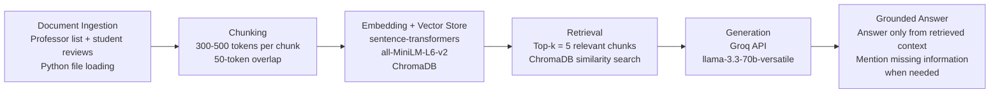

# Project 1 Planning: The Unofficial Guide

> Write this document before you write any pipeline code.
> Your spec and architecture diagram are what you'll use to direct AI tools (Claude, Copilot, etc.) to generate your implementation — the more specific they are, the more useful the generated code will be.
> Update the Retrieval Approach and Chunking Strategy sections if you change your approach during implementation.
> Update this file before starting any stretch features.

---

## Domain

<!-- What domain did you choose? Why is this knowledge valuable and hard to find through official channels? -->

My domain is student reviews of Computer Science professors at the University of Hawaii at Manoa. While the university’s official website provides information such as faculty research interests, contact details, and academic backgrounds, it does not offer insights into the classroom experience. This knowledge is valuable because students often want to understand a professor’s teaching style, workload, assessment methods, and course structure, such as whether classes rely heavily on readings or lecture slides, emphasize exams or projects, or include pop quizzes. These details are typically shared through student reviews and are difficult to find through official university channels.

---

## Documents

<!-- List your specific sources: URLs, subreddit names, forum threads, or file descriptions.
     Aim for at least 10 sources that together cover different subtopics or perspectives within your domain. -->

| #   | Source             | Description                                                                                                                                                                                          | URL or location                                    |
| --- | ------------------ | ---------------------------------------------------------------------------------------------------------------------------------------------------------------------------------------------------- | -------------------------------------------------- |
| 1   | UHM ICS Faculty    | Faculty directory for the Information and Computer Sciences department at University of Hawaiʻi at Mānoa, featuring faculty profiles, research interests, contact details, and academic backgrounds. | https://www.ics.hawaii.edu/people/                 |
| 2   | Rate My Professors | A Rate My Professors page for Kyungim Baek, showing student ratings, difficulty level, recommendation rate, and review statistics.                                                                   | https://www.ratemyprofessors.com/professor/1032361 |
| 3   | Rate My Professors | A Rate My Professors page for Edoardo Biagioni, showing student ratings, difficulty level, recommendation rate, and review statistics.                                                               | https://www.ratemyprofessors.com/professor/8389    |
| 4   | Rate My Professors | A Rate My Professors page for Henri Casanova, showing student ratings, difficulty level, recommendation rate, and review statistics.                                                                 | https://www.ratemyprofessors.com/professor/1070112 |
| 5   | Rate My Professors | A Rate My Professors page for Richard Halverson, showing student ratings, difficulty level, recommendation rate, and review statistics.                                                              | https://www.ratemyprofessors.com/professor/2013421 |
| 6   | Rate My Professors | A Rate My Professors page for Jason Leigh, showing student ratings, difficulty level, recommendation rate, and review statistics.                                                                    | https://www.ratemyprofessors.com/professor/1950937 |
| 7   | Rate My Professors | A Rate My Professors page for Carleton Moore, showing student ratings, difficulty level, recommendation rate, and review statistics.                                                                 | https://www.ratemyprofessors.com/professor/1898989 |
| 8   | Rate My Professors | A Rate My Professors page for Ravi Narayan, showing student ratings, difficulty level, recommendation rate, and review statistics.                                                                   | https://www.ratemyprofessors.com/professor/8392    |
| 9   | Rate My Professors | A Rate My Professors page for Dusko Pavlovic, showing student ratings, difficulty level, recommendation rate, and review statistics.                                                                 | https://www.ratemyprofessors.com/professor/2342816 |
| 10  | Rate My Professors | A Rate My Professors page for Andrey Popov, showing student ratings, difficulty level, recommendation rate, and review statistics.                                                                   | https://www.ratemyprofessors.com/professor/3048897 |
| 11  | Rate My Professors | A Rate My Professors page for Peter Sadowski, showing student ratings, difficulty level, recommendation rate, and review statistics.                                                                 | https://www.ratemyprofessors.com/professor/2639726 |

---

## Chunking Strategy

<!-- How will you split documents into chunks?
     State your chunk size (in tokens or characters), overlap size, and explain why those
     numbers fit the structure of your documents.
     A review-heavy corpus warrants different chunking than a long FAQ. -->

**Chunk size:** Between 300 to 500 tokens, or one full student review per chunk when the review is shorter than that range.

**Overlap:** 50 tokens for longer reviews that need to be split into multiple chunks.

**Reasoning:** Since my collection of student reviews is review-heavy, each student review should mostly stay together as one chunk so the meaning and context are not lost. A single review may mention several related details, such as teaching style, workload, exams, projects, grading, and classroom structure. Keeping each review together helps the retrieval system return complete student experiences instead of disconnected sentences. For longer reviews, a small 50-token overlap helps preserve context between chunks without creating too much repeated information.

---

## Retrieval Approach

<!-- Which embedding model are you using (e.g., all-MiniLM-L6-v2 via sentence-transformers)?
     How many chunks will you retrieve per query (top-k)?
     If you were deploying this for real users and cost wasn't a constraint, what tradeoffs
     would you weigh in choosing a different embedding model — context length, multilingual
     support, accuracy on domain-specific text, latency? -->

**Embedding model:** `all-MiniLM-L6-v2` using the `sentence-transformers` library

**Top-k:** 5 chunks per query.

**Production tradeoff reflection:**
For this project, `all-MiniLM-L6-v2` is a good choice because it runs locally, is fast, and does not require an API key or paid usage. Since the corpus is made up of short student reviews, a lightweight embedding model should be enough to retrieve relevant chunks about teaching style, workload, grading, exams, projects, and classroom experience.

If this system were deployed for real users and cost was not a constraint, I would consider using a stronger embedding model with higher retrieval accuracy and a larger context length. A larger context window could help with longer reviews or combined professor/course summaries. I would also consider whether the model handles domain-specific academic language well, since students may refer to course numbers, assignments, exams, or department-specific terms. Multilingual support could also matter if students write reviews in different languages. However, stronger models may have higher latency and require paid API usage, so I would weigh accuracy against speed, cost, and ease of deployment.

---

## Evaluation Plan

<!-- List your 5 test questions with their expected correct answers.
     Questions should be specific enough that you can judge whether the system's response
     is right or wrong. "What are good dining halls?" is too vague.
     "What do students say about wait times at [dining hall name] during lunch?" is testable. -->

| #   | Question                                                                                              | Expected answer                                                                                                                                                                                                                                                                                                                                              |
| --- | ----------------------------------------------------------------------------------------------------- | ------------------------------------------------------------------------------------------------------------------------------------------------------------------------------------------------------------------------------------------------------------------------------------------------------------------------------------------------------------ |
| 1   | What do students say about Peter Sadowski’s teaching style?                                           | The system should summarize student review evidence about Peter Sadowski’s teaching style, such as whether students describe the professor as clear, helpful, lecture-heavy, fast-paced, organized, or difficult to follow. The answer should only use information from the student reviews.                                                                 |
| 2   | According to student reviews, what is the workload like in Carleton Moore’s class?                    | The system should state whether students describe the workload as light, moderate, or heavy. It should mention specific review details such as programming assignments, projects, readings, homework frequency, exam preparation, or deadline difficulty.                                                                                                    |
| 3   | Do students say Henri Casanova’s course is more focused on exams, projects, homework, or quizzes?     | The system should identify the main assessment methods mentioned in the reviews. For example, it should say whether the course relies mostly on exams, projects, homework, pop quizzes, or a combination of these.                                                                                                                                           |
| 4   | What are Jason Leigh’s research interests, and what do students say about their classroom experience? | The system should combine sources carefully: it may answer the research-interest part using the official CS faculty source, but it should only answer the classroom-experience part if student reviews for Jason Leigh are available.                                                                                                                        |
| 5   | What do students say about Haopeng Zhang’s teaching style and workload?                               | Haopeng Zhang should be a professor who appears on the official CS faculty list but does not appear in the student review source. The expected answer is that the professor appears in the official faculty source, but there are no student reviews available in the provided review dataset, so the system cannot answer about teaching style or workload. |

---

## Anticipated Challenges

<!-- What could go wrong? Name at least two specific risks with reasoning.
     Consider: noisy or inconsistent documents, missing source attribution, off-topic
     retrieval, chunks that split key information across boundaries. -->

1. Student reviews may be noisy, inconsistent, or subjective. Different students may describe the same professor in very different ways depending on the course, semester, difficulty level, or personal experience. This could make it hard for the system to summarize a professor fairly without overemphasizing one strong opinion.

2. The system may mix official faculty information with student review information. Since one source contains official professor names and research interests while another source contains student reviews, the system might retrieve the official faculty page when the user asks about classroom experience. This is a risk because the official source can confirm that a professor exists, but it cannot answer questions about teaching style, workload, grading, or exams unless those details appear in the student reviews.

---

## Architecture

<!-- Draw a diagram of your pipeline showing the five stages:
     Document Ingestion → Chunking → Embedding + Vector Store → Retrieval → Generation
     Label each stage with the tool or library you're using.
     You can use ASCII art, a Mermaid diagram, or embed a sketch as an image.
     You'll use this diagram as context when prompting AI tools to implement each stage. -->

---

## AI Tool Plan

<!-- For each part of the pipeline below, describe:
     - Which AI tool you plan to use (Claude, Copilot, ChatGPT, etc.)
     - What you'll give it as input (which sections of this planning.md, which requirements)
     - What you expect it to produce
     - How you'll verify the output matches your spec

     "I'll use AI to help me code" is not a plan.
     "I'll give Claude my Chunking Strategy section and ask it to implement chunk_text()
     with my specified chunk size and overlap" is a plan. -->

**Milestone 3 — Ingestion and chunking:**

I plan to use Claude to help implement and review the ingestion and chunking code. I will give it my project domain description, chunking strategy, document sources, and the requirement that student reviews should mostly stay together as complete chunks when possible. I will ask it to help implement functions that load the official CS professor list and student review documents, attach metadata such as source type and professor name, and split longer reviews into 300–500 token chunks with a 50-token overlap.

I expect the AI tool to produce Python code for document loading, metadata handling, and a `chunk_text()` function that follows my specified chunk size and overlap. I will verify the output by printing sample chunks, checking that reviews are not split unnecessarily, confirming that long chunks have overlap, and making sure each chunk keeps useful metadata such as professor name and source type.

**Milestone 4 — Embedding and retrieval:**

I plan to use Claude to help implement the embedding and retrieval pipeline using sentence-transformers and ChromaDB. I will give it my embedding model choice, `all-MiniLM-L6-v2`, my top-k value of 5, and my architecture diagram showing the Embedding + Vector Store and Retrieval stages. I will ask it to help write code that converts chunks into embeddings, stores them in ChromaDB, and retrieves the top 5 most relevant chunks for a user query.

I expect the AI tool to produce Python code that initializes the embedding model, creates or loads a ChromaDB collection, stores chunks with metadata, and implements a `retrieve(query)` function. I will verify the output by running my 5 test questions and checking whether the retrieved chunks come from the correct professor and source. I will also test a professor who appears in the official faculty list but does not have student reviews to make sure the system does not incorrectly retrieve unrelated student review information.

**Milestone 5 — Generation and interface:**

I plan to use Claude to help write the generation prompt and basic user interface logic. I will give it my project goal, anticipated challenges, test questions, and the requirement that the answer must be grounded only in retrieved chunks. I will ask it to help implement a `generate_response(query, retrieved_chunks)` function using the Groq API with `llama-3.3-70b-versatile`.

I expect the AI tool to produce code that formats retrieved chunks into a clear context block, asks the model to answer only from that context, and tells the model to say when there is not enough information. I will verify the output by checking whether answers mention the correct source, avoid making claims not supported by retrieved reviews, and correctly distinguish between official faculty information and student review information. I will also compare the system’s answers against my expected answers for the 5 test questions.
